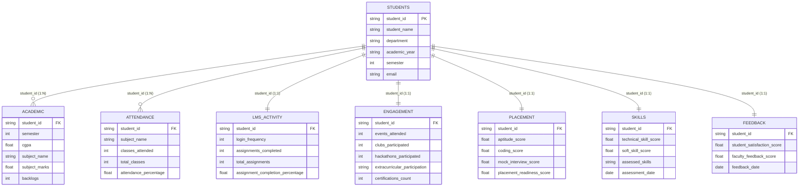

# Smart Campus Analytics: Dataset Documentation (Phase 1)

> **Project:** Smart Campus Analytics: Predict, Optimize & Improve Student Success  
> **Phase:** Phase 1 — Dataset Creation and Validation  
> **Version:** 1.0.0  
> **Synthetic Data Notice:** All records in this dataset are purely synthetic and generated programmatically for educational, hackathon, and analytical modeling purposes. No personally identifiable information (PII) or records belonging to real individuals were used.

---

## 1. Executive Overview

The **Smart Campus Analytics** platform is designed primarily for **students**, empowering them to understand holistic performance across seven critical dimensions:
1. **Academic Performance**
2. **Attendance Tracking**
3. **LMS Activity & Online Engagement**
4. **Campus Engagement & Co-curricular Involvement**
5. **Placement & Career Readiness**
6. **Technical & Soft Skill Profiling**
7. **Institutional & Faculty Feedback**

The dataset consists of **8 interconnected CSV files** located in the `data/` directory, modeling **120 fictional students** spanning varied academic years, engineering departments, and performance profiles (high achievers, steady learners, at-risk students, and technical specialists).

---

## 2. Entity Relationship & Data Model

The master student entity (`students.csv`) serves as the root table. All child tables maintain foreign key referential integrity referencing `student_id`.



---

## 3. Detailed File Specifications

### 3.1 `students.csv` (Student Master)
* **File Path:** `data/students.csv`
* **Row Count:** 120
* **Primary Key:** `student_id`
* **Description:** Master directory containing baseline demographic and program details for each enrolled student.

| Column Name | Data Type | Value Range / Format | Nullable | Description |
| :--- | :--- | :--- | :--- | :--- |
| `student_id` | String | `STU1001` - `STU1120` | No | Unique student identifier |
| `student_name` | String | e.g., "Aarav Sharma" | No | Student full name (fictional) |
| `department` | String | CSE, IT, ECE, DS, MECH | No | Academic engineering department |
| `academic_year`| String | "2nd Year", "3rd Year", "4th Year" | No | Current academic year standing |
| `semester` | Integer | 3, 5, 7 | No | Current semester of study |
| `email` | String | `*@smartcampus.edu` | No | Institutional email address |

---

### 3.2 `academic.csv` (Academic Performance)
* **File Path:** `data/academic.csv`
* **Row Count:** 480 (4 core subjects per student)
* **Primary Key:** Composite (`student_id`, `subject_name`)
* **Foreign Key:** `student_id` -> `students.csv` (`student_id`)
* **Description:** Granular subject-wise academic marks, cumulative grade point average (CGPA), and backlog tracking.

| Column Name | Data Type | Value Range / Format | Nullable | Description |
| :--- | :--- | :--- | :--- | :--- |
| `student_id` | String | `STU1001` - `STU1120` | No | Foreign key linking to master student record |
| `semester` | Integer | 3, 5, 7 | No | Semester corresponding to enrolled subjects |
| `cgpa` | Float | 0.00 to 10.00 (Observed: 4.10 - 9.85) | No | Cumulative Grade Point Average (scale of 10) |
| `subject_name` | String | Department-specific curriculum | No | Name of the evaluated subject |
| `subject_marks`| Float | 0.0 to 100.0 (Observed: 25.0 - 99.0) | No | Marks scored in internal/final subject assessment |
| `backlogs` | Integer | 0 to 4 | No | Count of active un-cleared backlogs |

---

### 3.3 `attendance.csv` (Attendance Tracking)
* **File Path:** `data/attendance.csv`
* **Row Count:** 480 (1-to-1 subject correspondence with `academic.csv`)
* **Primary Key:** Composite (`student_id`, `subject_name`)
* **Foreign Key:** `student_id` -> `students.csv` (`student_id`)
* **Description:** Classroom attendance metrics tracking physical or online session attendance per subject.

| Column Name | Data Type | Value Range / Format | Nullable | Description |
| :--- | :--- | :--- | :--- | :--- |
| `student_id` | String | `STU1001` - `STU1120` | No | Student identifier |
| `subject_name` | String | Department-specific curriculum | No | Name of subject course |
| `classes_attended`| Integer | 0 to `total_classes` (Observed: 17 - 53) | No | Number of lectures attended |
| `total_classes`| Integer | 48, 50, 52, 54 | No | Total lectures conducted in semester |
| `attendance_percentage` | Float | 0.00 to 100.00% (Observed: 34.00 - 98.15%) | No | Derived: `round((classes_attended / total_classes) * 100, 2)` |

---

### 3.4 `lms_activity.csv` (Learning Management System Engagement)
* **File Path:** `data/lms_activity.csv`
* **Row Count:** 120
* **Primary Key:** `student_id`
* **Foreign Key:** `student_id` -> `students.csv` (`student_id`)
* **Description:** Digital footprint metrics captured from campus portal/LMS platforms.

| Column Name | Data Type | Value Range / Format | Nullable | Description |
| :--- | :--- | :--- | :--- | :--- |
| `student_id` | String | `STU1001` - `STU1120` | No | Student identifier |
| `login_frequency` | Integer | 0 to 70 (Observed: 5 - 64 logins/month) | No | Monthly access frequency to online course materials |
| `assignments_completed` | Integer | 0 to `total_assignments` (Observed: 3 - 12) | No | Number of LMS assignments submitted |
| `total_assignments` | Integer | Fixed at 12 | No | Total mandatory LMS assignments |
| `assignment_completion_percentage` | Float | 0.00 to 100.00% (Observed: 25.00 - 100.00%) | No | Derived: `round((assignments_completed / total_assignments) * 100, 2)` |

---

### 3.5 `engagement.csv` (Co-curricular & Extracurricular Activity)
* **File Path:** `data/engagement.csv`
* **Row Count:** 120
* **Primary Key:** `student_id`
* **Foreign Key:** `student_id` -> `students.csv` (`student_id`)
* **Description:** Holistic student participation in hackathons, university clubs, cultural/technical events, and certifications.

| Column Name | Data Type | Value Range / Format | Nullable | Description |
| :--- | :--- | :--- | :--- | :--- |
| `student_id` | String | `STU1001` - `STU1120` | No | Student identifier |
| `events_attended` | Integer | 0 to 12 | No | College fests, seminars, guest lectures attended |
| `clubs_participated`| Integer | 0 to 4 | No | Active registered student societies or clubs |
| `hackathons_participated`| Integer | 0 to 8 | No | Technical competitive coding hackathons attended |
| `extracurricular_participation` | String | "High", "Medium", "Low" | No | Categorical tier of student involvement |
| `certifications_count` | Integer | 0 to 5 | No | Verified industry/online MOOC certificates achieved |

---

### 3.6 `placement.csv` (Career & Placement Readiness)
* **File Path:** `data/placement.csv`
* **Row Count:** 120
* **Primary Key:** `student_id`
* **Foreign Key:** `student_id` -> `students.csv` (`student_id`)
* **Description:** Campus recruitment training scores assessing quantitative aptitude, coding benchmarks, and interview readiness.

| Column Name | Data Type | Value Range / Format | Nullable | Description |
| :--- | :--- | :--- | :--- | :--- |
| `student_id` | String | `STU1001` - `STU1120` | No | Student identifier |
| `aptitude_score` | Float | 0.0 to 100.0 (Observed: 32.2 - 97.9) | No | Quantitative & logical reasoning test score |
| `coding_score` | Float | 0.0 to 100.0 (Observed: 30.5 - 98.8) | No | Algorithmic programming assessment score |
| `mock_interview_score`| Float | 0.0 to 100.0 (Observed: 32.6 - 95.8) | **Yes** (6 records / 5.0%) | Mock HR & Technical interview evaluation score |
| `placement_readiness_score` | Float | 0.00 to 100.00 (Observed: 33.32 - 97.10) | No | Composite index indicating overall placement readiness |

#### Placement Readiness Formulation:
- **Standard Profile (Mock interview completed):**
  $$\text{Placement Readiness} = 0.30 \times \text{Aptitude} + 0.40 \times \text{Coding} + 0.30 \times \text{Mock Interview}$$
- **Pending Mock Interview (Realistic Synthetic Scenario):**
  $$\text{Placement Readiness} = 0.40 \times \text{Aptitude} + 0.60 \times \text{Coding}$$

---

### 3.7 `skills.csv` (Skills Matrix & Assessment)
* **File Path:** `data/skills.csv`
* **Row Count:** 120
* **Primary Key:** `student_id`
* **Foreign Key:** `student_id` -> `students.csv` (`student_id`)
* **Description:** Technical proficiency, interpersonal soft skill ratings, and syllabus competency keywords.

| Column Name | Data Type | Value Range / Format | Nullable | Description |
| :--- | :--- | :--- | :--- | :--- |
| `student_id` | String | `STU1001` - `STU1120` | No | Student identifier |
| `technical_skill_score` | Float | 0.0 to 100.0 (Observed: 35.2 - 96.8) | No | Standardized technical domain proficiency score |
| `soft_skill_score` | Float | 0.0 to 100.0 (Observed: 35.4 - 94.7) | **Yes** (4 records / 3.3%) | Communication, teamwork, and leadership score |
| `assessed_skills` | String | Comma-delimited strings | No | Specific skills evaluated for student's department |
| `assessment_date` | Date (ISO) | `2026-08-10` to `2026-09-23` (`YYYY-MM-DD`)| No | Date on which skills evaluation was administered |

---

### 3.8 `feedback.csv` (Student Satisfaction & Faculty Appraisal)
* **File Path:** `data/feedback.csv`
* **Row Count:** 120
* **Primary Key:** `student_id`
* **Foreign Key:** `student_id` -> `students.csv` (`student_id`)
* **Description:** Institutional feedback capturing self-reported student satisfaction and mentor faculty observations.

| Column Name | Data Type | Value Range / Format | Nullable | Description |
| :--- | :--- | :--- | :--- | :--- |
| `student_id` | String | `STU1001` - `STU1120` | No | Student identifier |
| `student_satisfaction_score` | Float | 1.0 to 5.0 (Observed: 2.0 - 5.0) | **Yes** (5 records / 4.2%) | Student self-reported course and campus experience rating |
| `faculty_feedback_score` | Float | 1.0 to 5.0 (Observed: 2.0 - 5.0) | No | Academic advisor / faculty mentor appraisal rating |
| `feedback_date` | Date (ISO) | `2026-09-01` to `2026-09-30` (`YYYY-MM-DD`)| No | Submission date of feedback appraisal |

---

## 4. Student Profiles & Distribution Dynamics

The synthetic population reflects realistic clusters observed in university engineering programs:

1. **High Achievers (~20%):**
   - High CGPA (8.60 - 9.85), 0 backlogs.
   - Attendance > 88%, LMS login frequency > 40/month, 90-100% assignment completion.
   - High placement readiness (> 85), active in clubs (2-4), hackathons (2-6), and certifications.
2. **Steady / Average Performers (~45%):**
   - CGPA (7.00 - 8.50), 0 backlogs.
   - Attendance (75% - 87%), moderate LMS activity (22-40 logins/month).
   - Placement readiness (65 - 84), balanced extracurricular profile.
3. **Underperforming / Needs Support (~20%):**
   - CGPA (5.50 - 6.90), 0-2 backlogs.
   - Attendance (66% - 76%), lower LMS activity (12-24 logins/month).
   - Placement readiness (48 - 66), targeted coaching recommended.
4. **At-Risk Students (~10%):**
   - CGPA (4.10 - 5.40), 1-4 backlogs.
   - Attendance (< 65%), low LMS activity (5-14 logins/month), low assignment completion (25-58%).
   - Placement readiness (< 50), critical academic alerts and intervention necessary.
5. **Practical Specialist / Hacker (~5%):**
   - Moderate CGPA (6.60 - 7.60), 0-1 backlogs.
   - Exceptional coding score (> 92), high hackathon participation (4-8), and superior technical skill score.

---

## 5. Realistic Missing Value Strategy

In institutional data systems, non-critical metrics frequently possess legitimate missing values (due to scheduled rounds, optional surveys, or pending evaluations):
- **Mock Interviews (`placement.csv`):** 6 students (5.0%) have pending mock interview rounds.
- **Soft Skills (`skills.csv`):** 4 students (3.3%) have pending behavioral evaluations.
- **Student Satisfaction (`feedback.csv`):** 5 students (4.2%) have not completed optional end-of-term satisfaction forms.
- **Zero Missing Values** across all identifiers, master demographics, academic grades, LMS completions, and faculty appraisals.

---

## 6. How to Run Validation

To verify dataset health, execute the validation script from the project root:

```powershell
python validate_data.py
```

### Validation Capabilities:
- Checks presence of all 8 files.
- Verifies exact required column headers.
- Confirms zero primary key or composite duplicate records.
- Ensures missing value rates are within acceptable limits and confined to permissible non-key columns.
- Enforces 100% foreign key referential integrity with `students.csv`.
- Verifies mathematical identity of derived percentage formulas (`attendance_percentage`, `assignment_completion_percentage`).
- Tests all numerical, categorical, and email bounds.
